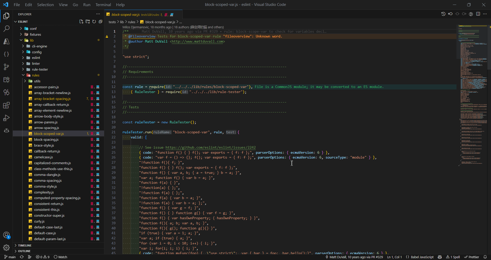
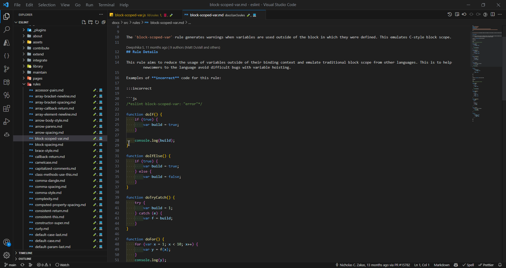

# File Jumper 🦘: Intelligent File Navigation for VSCode

File Jumper is a handy VSCode extension that simplifies navigation between related files in your workspace. It detects and helps you quickly jump to associated files, based on your own rules, making your workflow more efficient.



## Key features

- 🚀 Dynamically detects related files based on user configuration.
- 👁️ Visualizes related files with customizable icons, e.g. whether a file has tests.
- 🔄 Updates file links when workspace folders, files, or configuration changes.
- 🎨 Uses customizable RegEx patterns to accommodate complex folder structures and relations.

Try File Jumper today and experience a smoother, more connected file navigation experience in VSCode! 🚀

# Installation

Install the extension from the [VSCode Marketplace](https://marketplace.visualstudio.com/items?itemName=ecm.file-jumper) or by searching for "File Jumper" in the VSCode extensions panel.

# Configuration

Customize the extension's behavior by modifying the settings [documented here](#) in your VSCode `settings.json`.

The extension will automatically detect changes to the configuration and update the file links accordingly.


# Usage

To use File Jumper, simply right-click on a file in the file explorer panel or on a file tab which has one of the icons from your configuration (which shows it has links to other files) and select "Jump to...".

You'll be presented with a list of related files, which you can quickly filter and select. The chosen file will open in a new tab.

# Realistic Examples

## Eslint

The [Eslint](https://github.com/eslint/eslint) project has the perfect structure to demonstrate the power of File Jumper. It is very organised and consistently named with:

- a `lib` folder containing the source code
- a `tests` folder containing the tests
- a `docs` folder containing the documentation

Where the file structure in those root folders are the same, except for the prefix, which makes it easy to define patterns for linking those files together.

Here is an example configuration for the Eslint project (note: the prefix capture group isn't required here as the file structure isn't nested):

```json
{
  "fileJumper.fileTypes": {
    "Source Code": {
      "icon": "💻",
      "patterns": ["(?<!\\/tests\\/)lib\\/(?<topic>.+)\\.(js|jsx|ts|tsx)$"]
    },
    "Test Code": {
      "icon": "🧪",
      "patterns": ["(?<=\\/tests\\/)lib\\/(?<topic>.+)\\.(js|jsx|ts|tsx)$"]
    },
    "Documentation": {
      "icon": "📃",
      "patterns": ["\\/docs\\/src\\/(?<topic>.+)\\.md$"]
    }
  }
}
```

This configuration and the Eslint project were used to create the demos above.

This creates links between files which are visualised with icons in the file explorer as below (which also makes it easier to identify removed rules without source code or tests):



## Rxjs

The [Rxjs](https://github.com/reactivex/rxjs) project is another good example, however in this case there are some naming inconsistencies e.g. there are spec files in `spec/observables/` however the related code for these files are in `src/internal/observable/` (ie the folder goes from a plural to a singular), same issue for the `spec/schedulers/` folder also. However its not an issue and we can still create links between these files by taking advantage of the flexibility of RegEx.

Here is an example configuration for the Rxjs project (note: the prefix capture group isn't required here as the file structure isn't nested):

```json
{
  "fileJumper.fileTypes": {
    "Source Code": {
      "icon": "💻",
      "patterns": [
        "\\/src\\/internal\\/(observable|scheduler)s?\\/(?<topic>.+)\\.ts$",
        "\\/src\\/internal\\/(?<topic>.+)\\.ts$"
      ]
    },
    "Spec": {
      "icon": "🧪",
      "patterns": [
        "\\/spec\\/(observable|scheduler)s?\\/(?<topic>.+)-spec\\.ts$",
        "\\/spec\\/(?<topic>.+)-spec\\.ts$"
      ]
    }
  }
}
```

In this case we need to define multiple patterns, ie one to match the exceptions first then a fall back pattern for the normal case, which links the files as follows:


# Contributing

This project is still in its early stages and any contributions are welcome!

Contribution guide TBC

# References

- Extension icon made by Google Fonts, see [Noto Emoji](https://github.com/googlefonts/noto-emoji) ([image](https://github.com/googlefonts/noto-emoji/blob/main/png/512/emoji_u1f998.png))
