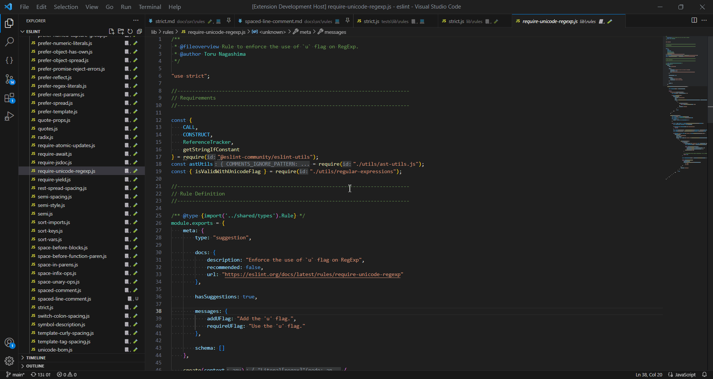
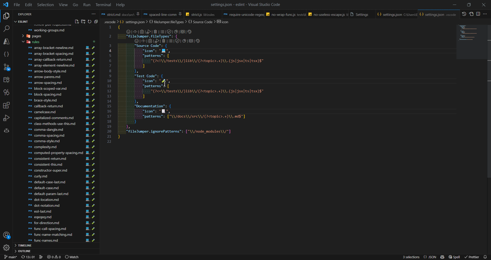

# File Jumper 🦘: Intelligent File Navigation for VSCode

File Jumper is a handy VSCode extension that simplifies navigation between related files in your workspace. It detects and helps you quickly jump to associated files, based on your own rules, making your workflow more efficient.



## Key features:

- 🚀 Dynamically detects related files based on user configuration.
- 👁️ Visualizes related files with customizable icons.
- 🖱️ Displays a context menu showing all linked files for easy access.
- 🔄 Updates file links when workspace folders or configurations change.
- 🤝 Handles file renames, creations, and deletions seamlessly.
- 🎨 Flexible and customizable to accommodate different file types and relations.
- 📝 Supports RegEx patterns for more powerful matching.
- 📦 Supports mono-repos and multi-root workspaces.

Try File Jumper today and experience a smoother, more connected file navigation experience in VSCode! 🚀

# Configuration

Customize the extension's behavior by modifying the following settings in your VSCode `settings.json`.

The extension will automatically detect changes to the configuration and update the file links accordingly.



## fileJumper.fileTypes

An object that defines the file types in a project that will be evaluated for automatic linking.

The object keys represent the file type names. The values are objects that define the file type's behavior. The following properties are supported:

- `icon`: An icon character (e.g. an emoji) displayed as a badge in the file explorer on files related to this file type.
- `patterns`: An array of RegEx patterns to match relevant files and capture the topic and/or a prefix. More detail below.
- `onlyLinkTo`: (**OPTIONAL**) Array of other file types that this file type produces links to. By default, all file types can be linked to all other file types.
- `onlyLinkFrom`: (**OPTIONAL**) Array of other file types that can link to this file type. By default, all file types can be linked to all other file types.

**NOTE** A Minimum of 2 file type definitions (properties) is required to be able to show links between files.

### **Patterns and Links**

The extension uses RegEx for matching file paths, instead of glob patterns, to allow for more flexibility in the rules that can be defined.

The extension requires defined RegEx patterns to capture specific named groups from file paths which will be used to determine if files of different types are related. The named groups that can be matched are:

- `topic`: This represents the part of the file path that is repeated for related files. For example, a file `src/components/Button.ts`, the topic could be `components/Button` which could be used to match a test file `test/components/Button.test.ts`. The example configuration below shows example file type definitions that can achieve this link.
- `prefix`: (**OPTIONAL**) This represents the the root path and can be used to differentiate between files with a similar structure but from different root folders (e.g. a mono-repo) e.g. `packages/PackageA/src/components/Button.ts` and `packages/PackageB/test/components/Button.test.ts` would have a link if a prefix capture group is not defined. If your project does not have this structure, you can omit this capture group.

The extension will automatically link all files of different types that resolve to the same topic and prefix (if defined). You can customise which files can link to/from other files by using the `onlyLinkTo` and `onlyLinkFrom` properties.

### **Example configuration**:

```json
"fileJumper.fileTypes": {
  "Test": {
    "icon": "🧪",
    "patterns": [
      "(?<prefix>.+)\\/(test|tests)\\/(?<topic>.+)\\.test\\.ts$"
    ]
  },
  "Source": {
    "icon": "📄",
    "patterns": [
      "(?<prefix>.+)\\/(src)\\/(?<topic>.+)\\.ts$"
    ]
  }
}
```

## fileJumper.ignorePatterns

Defines the RegEx patterns of files to ignore when determining file links.

**Default**: `["/node_modules/"]`

Example configuration:

```json
"fileJumper.ignorePatterns": [
  "\\/node_modules\\/",
  "\\/dist\\/"
]
```

# Usage

To use File Jumper, simply right-click on a file in the file explorer panel or on a file tab and select "Jump to...". You'll be presented with a list of related files, which you can quickly filter and select. The chosen file will open in a new tab.

# Realistic Example - Eslint

The [Eslint](https://github.com/eslint/eslint) project has the perfect structure to demonstrate the power of File Jumper. It is very organised with:

- a `lib` folder containing the source code
- a `tests` folder containing the tests
- a `docs` folder containing the documentation

Where the file structure in those root folders are the same, except for the prefix, which makes it easy to define patterns for linking those files together.

Here is an example configuration for the Eslint project (note: the prefix capture group isn't required here as the file structure isn't nested):

```json
{
  "fileJumper.fileTypes": {
    "Source Code": {
      "icon": "💻",
      "patterns": ["(?<!\\/tests\\/)lib\\/(?<topic>.+)\\.(js|jsx|ts|tsx)$"]
    },
    "Test Code": {
      "icon": "🧪",
      "patterns": ["(?<=\\/tests\\/)lib\\/(?<topic>.+)\\.(js|jsx|ts|tsx)$"]
    },
    "Documentation": {
      "icon": "📃",
      "patterns": ["\\/docs\\/src\\/(?<topic>.+)\\.md$"]
    }
  },
  "fileJumper.ignorePatterns": ["\\/node_modules\\/"]
}
```

This configuration and the Eslint project were used to create the demos above.

# Contributing

This project is still in its early stages and any contributions are welcome!

Contribution guide TBC

# References

- Extension icon made by Google Fonts, see [Noto Emoji](https://github.com/googlefonts/noto-emoji) ([image](https://github.com/googlefonts/noto-emoji/blob/main/png/512/emoji_u1f998.png))
